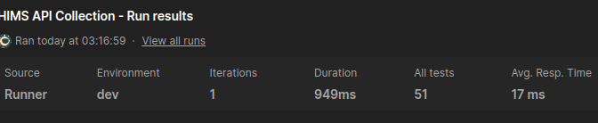

# Health Information System

## Technologies used

- Golang 1.24 <https://go.dev/dl/>
- Make <https://www.gnu.org/software/make/>
- PostgreSQL <https://www.pgadmin.org/download/>
- Docker <https://docs.docker.com/desktop/>
- Air (live reload) <https://github.com/air-verse/air>

#### Powerpoint presentation: <https://docs.google.com/presentation/d/13AXW5XdrwVaTFrY5SfnqQbtQ2RmhCLUZSyFV4tloCIc/edit?usp=sharing>

#### Database design: <https://github.com/wathika-eng/hims/blob/main/drawSQL-image-export-2025-04-27.png>

#### API testing: <https://www.postman.com/wathika/workspace/hims/collection/34083824-6c634517-02b7-4dfa-bbc0-fb585679cc2c?action=share&creator=34083824&active-environment=34083824-cb65b2c7-8738-47f7-8808-11bf34479d7c>

#### Live API: <http://159.89.7.122:8000>

### Setup local development

Ensure Make, Go, PostgreSQL, and Docker are installed on your machine.
Without Make and Docker, you can't run the application.

1. Clone the repository

   ```bash
   git clone https://github.com/wathika-eng/hims --depth 1
   # cd into the directory 
   cd hims
   ```

2. Install dependencies

   ```bash
   make deps
   # or with go
   go mod tidy
   ```

3. Create a `.env` file

   ```bash
    cp .env.example .env
    cp .env.example .env.local
    ```

4. Create a PostgreSQL database

    ```bash
    # create a database with the name in .env
    createdb -U postgres -h localhost -p 5432 hims
    ```

5. Run the application with live reload

    ```bash
    air
    ```

6. With docker:

    ```bash
    COMPOSE_BAKE=true docker-compose up -d
    # or
    make docker-build
    make docker-run
    ```
    <!-- or
    ```bash
    docker build -t hims .
    docker run -p 8080:8080 hims
    docker run --env-file .env -v $(pwd)/.env:/root/.env hims:latest
    ``` -->

#### Resources used

<https://12factor.net/>
<https://bun.uptrace.dev/guide/golang-orm.html>
<https://testcontainers.com/guides/getting-started-with-testcontainers-for-go/>

##### Tests

